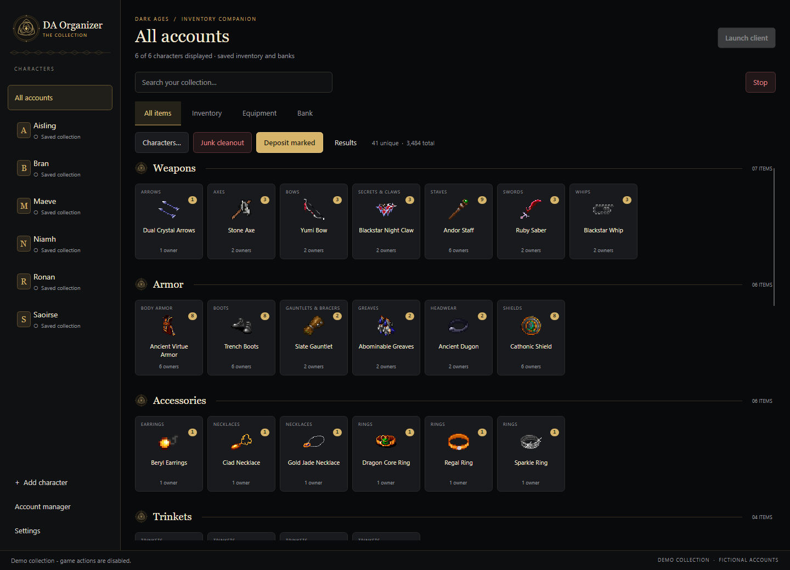
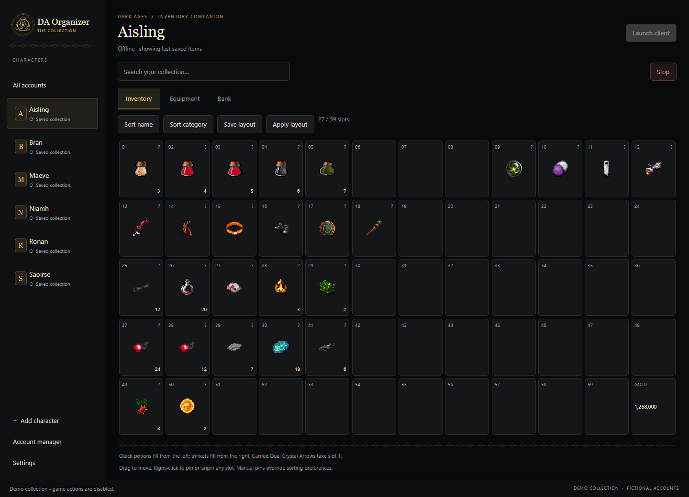
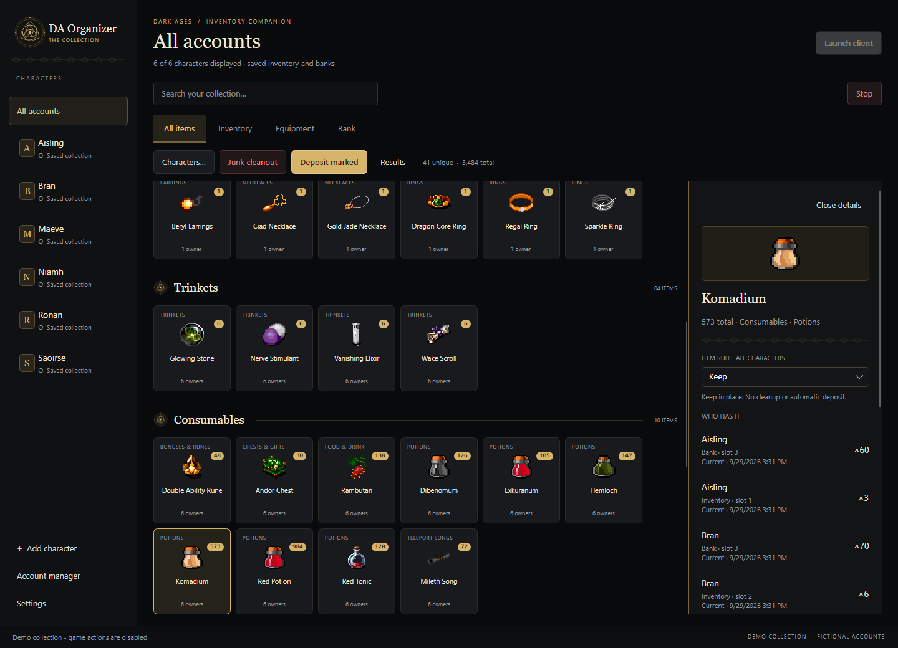

<div align="center">

# DAOrganizer

**Your Dark Ages collection, brought together.**

A Windows inventory companion with a black-and-gold Celtic interface.
Find items across characters, arrange your inventory, and review what stays, banks, or goes.

[](https://github.com/buildwithraymond/DAOrganizer/actions/workflows/build.yml)
[](LICENSE)
[](docs/GETTING_STARTED.md)
[](global.json)

[**Download for Windows**](https://github.com/buildwithraymond/DAOrganizer/releases/latest) · [Getting started](docs/GETTING_STARTED.md) · [Contributing](CONTRIBUTING.md) · [Report a bug](https://github.com/buildwithraymond/DAOrganizer/issues/new/choose)

</div>



## A place for everything

- **One searchable collection.** Inventory, equipment and bank snapshots from every displayed character, grouped by category and item family.
- **Know who has it.** Quantity badges combine matching items. Click a tile for owners, locations, slots and snapshot freshness. Opening details keeps your place in the grid.
- **An inventory that makes sense.** The game's 12-column layout, drag-to-move, pinned slots, saved layouts and reviewed sorting with server confirmation.
- **Flexible quick slots.** Carried Dual Crystal Arrows take slot 1. Available quick potions pack from the left; trinkets fill row one from the right. Pin or unpin any slot, and move potions freely.
- **Rules you control.** Keep, Junk and Auto-deposit are explicit choices. Cleanout and deposit runs show a review before starting.
- **Bank snapshots and account updates.** Read bank contents through a nearby NPC as soon as login completes. WorldLogs and bank travel are needed only for transfers; travel runs in the background.
- **Local by default.** Snapshots stay in SQLite on your machine. Optional saved passwords use Windows Credential Manager.

<table>
<tr>
<td width="50%"><br/><strong>Inventory, with game sprites</strong></td>
<td width="50%"><br/><strong>Every owner. Every location.</strong></td>
</tr>
</table>

*Screenshots are actual app renders using fictional accounts and original Dark Ages sprites loaded from a local game installation. Raw game assets are not bundled. Game artwork remains the property of its respective owners.*

## Try it

1. Download the **Windows x64 ZIP** from [Releases](https://github.com/buildwithraymond/DAOrganizer/releases/latest).
2. Extract the entire folder and open `DAOrganizer.exe`. Keep its companion files beside it; .NET is included.
3. Set your game executable and WorldLogs folder in **Settings**, then add a character and launch through the organizer.

Want to explore without a game installation?

```powershell
.\DAOrganizer.exe --demo
```

Demo mode uses an in-memory collection and loads sprites from a local game installation when available. Set `DAORGANIZER_GAME_DATA` to a different game-data folder if needed. Without game files, item names are shown instead of substitute artwork.

Demo mode cannot launch game clients, perform item operations or save passwords, and it never opens your real account database.

**Current game support:** Windows x64 and the supported Dark Ages DATester 7.41 executable. The launcher checks its exact hash. Other builds are rejected. The app tracks clients it launches; it does not attach to existing clients.

See [Getting started](docs/GETTING_STARTED.md) for account setup, bank scans, maintenance and switching versions.

## Build from source

Requires Windows and the [.NET 10 SDK](https://dotnet.microsoft.com/download/dotnet/10.0). No game files are needed to build, test or run the demo.

```powershell
git clone https://github.com/buildwithraymond/DAOrganizer.git
cd DAOrganizer
dotnet restore DAOrganizer.slnx -m:1
dotnet build DAOrganizer.slnx -c Release --no-restore -m:1 -p:UsedAvaloniaProducts=
dotnet run --project src/DAOrganizer.App -c Release --no-build -- --demo
```

Run the checks and make a portable Windows package:

```powershell
dotnet test tests/DAOrganizer.Tests -c Release --no-build -m:1
dotnet tests/DAOrganizer.UiChecks/bin/Release/net10.0/DAOrganizer.UiChecks.dll artifacts/ui-checks
dotnet tests/DAOrganizer.UiChecks/bin/Release/net10.0/DAOrganizer.UiChecks.dll artifacts/gallery --gallery
.\tools\Package.ps1 -Output artifacts/DAOrganizer
```

CI builds the solution, runs protocol/unit checks, exercises the UI with synthetic data, verifies demo isolation, renders screenshots and packages the app. See [Actions](https://github.com/buildwithraymond/DAOrganizer/actions) and [verification details](docs/CI.md).

## Project map

| Path | Responsibility |
| --- | --- |
| `src/DAOrganizer.App` | Avalonia desktop UI, account orchestration, original vector artwork and demo |
| `src/DAOrganizer.Core` | Persistence, categories, slot plans, routes and maintenance planning |
| `src/DAOrganizer.Game` | Proxy sessions, native client launch/input, packet-confirmed actions |
| `tests/DAOrganizer.Tests` | Unit and synthetic packet replay tests |
| `tests/DAOrganizer.UiChecks` | Headless interaction checks and screenshot gallery |
| `vendor/Arbiter` | Vendored MIT-licensed protocol, process and sprite libraries |

More detail: [Architecture](docs/ARCHITECTURE.md) · [Protocol research](docs/RESEARCH.md) · [Design](docs/design/black-and-gold.md) · [Changelog](CHANGELOG.md).

## Before moving real items

Junk cleanout drops selected items on the ground, where they can be lost or picked up by other players. Review the preview. The server does not expose a reliable transferability flag; marked junk is attempted once and rejected or unconfirmed actions are not automatically retried.

Snapshots can be stale. Bank silence after a correlated withdrawal-list request is treated as an empty bank. Saved-login baselines and travel routes rely on observed protocol behavior; some destinations still need manual handling. Automated checks use synthetic packets and are not a guarantee of every live-game condition. Read the [operational limits](docs/GETTING_STARTED.md#operational-limits).

## Contribute

Bug reports, focused fixes, item-category corrections and UI improvements are welcome. Start with [CONTRIBUTING.md](CONTRIBUTING.md). Keep credentials and game files out of issues and pull requests. For private vulnerability reports, see [SECURITY.md](SECURITY.md).

## License and credits

Original code and vector artwork: [MIT](LICENSE). Vendored code retains its upstream licenses; see [THIRD_PARTY_NOTICES.md](THIRD_PARTY_NOTICES.md).

Built with Avalonia, .NET, SQLite and [Arbiter](https://github.com/ewrogers/Arbiter). Item-category references include [Vorlof](https://vorlof.com/general/consumables.php). Dark Ages and its assets belong to their respective owners. This is an independent community project, not an official game client or an affiliated product.
