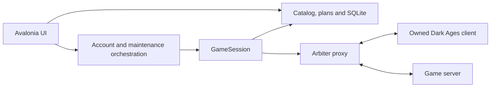

# Architecture

DA Organizer is a .NET 10 / Avalonia desktop application. Live game integration is Windows-specific.

## Boundaries

`DAOrganizer.Core` has no UI or native-window dependency. It holds immutable item records, category heuristics, identity rules, slot planning, bank parsing, route graphs and queue policies. Plans retain original slot identity so duplicate-looking items cannot be confused.

`DAOrganizer.Game` owns the proxy session, serialized observation queue, tracked inventory and per-session action gate. Actions check rules and current state, send one protocol request and wait for the expected inventory change. Unconfirmed destructive actions are not retried. The native input layer is used for supported login/window operations; navigation uses protocol walking.

`DAOrganizer.App` builds the interface in C# with shared Avalonia styles. Refreshes render observed state. Aggregate grids restore an item anchor after layout so opening the ownership drawer does not reset scrolling. `Ornaments.cs` draws original Celtic marks. Item sprites, including demo artwork, are read from the installed game at runtime; missing sprites use text.

## Data

SQLite stores characters, snapshot state, item records and settings. Windows Credential Manager stores optional login secrets separately. Item identity is name, sprite and color. Category overrides are explicit settings; category inference never changes identity.

Schema v2 adds explicit game-account membership, coexistence policies, storage roles, exact-item preferences, local metadata and trade observations. `ReadOrganizationState()` takes one SQLite read transaction and fingerprints all organization inputs. `OrganizationPlanner` produces read-only bank consolidation opportunities, including inventory-held matches and direct/middleman/manual route candidates. Potential savings stay separate from verified savings. The UI never executes these proposals yet.

`ManualTradeTrace` is an opt-in, bounded local observer of exchange and inventory packets from two organizer-proxied sessions. It records before/after inventory snapshots for protocol validation. `ManualTradeAnalyzer` checks paired sessions, partners, offers, accepts, and item conservation. A verified capture records one deduplicated local tradeability success; ambiguous captures record none. Neither component sends exchange packets or uploads traces. See [capture instructions](MANUAL_TRADE_CAPTURE.md).

Manual single-item and partial-stack trades validated the action-1 writer fix, action-2 quantity layout, and several inbound exchange/inventory variants. See the [single-item](protocol-captures/2026-09-29-manual-single-item.md) and [partial-stack](protocol-captures/2026-09-29-manual-partial-stack.md) observations. Final custody semantics and a defensive two-session coordinator still gate outbound automation.

Demo mode uses a separate in-memory store and explicit guards around game operations and credential changes. Screenshot generation invokes this same mode. No account profile or raw game files are included in the repository. Public screenshots depict original game sprites with fictional names and quantities.

## Tests

Unit and replay tests use synthetic packets, including movement confirmations, bank actions, partial scans, cancellation, duplicates, manual pins, compact quick slots and malformed data. Avalonia headless checks exercise real pointer drag/click behavior, scrolling, item rules and canceled previews. The gallery validates demo isolation and renders the shipping UI.

## Extending the project

Keep packet changes in Game or the smallest necessary vendored protocol type, and document vendor changes. Keep classification rules in Core and test concrete examples. UI-only changes should not change live action authorization or confirmation. Add a reproduction when fixing a behavioral bug; avoid tests that only restate implementation details.

Proposed cross-character storage architecture and phased implementation: [Cross-character organization design](superpowers/specs/2026-09-29-cross-character-organization-design.md). Current work checkpoint: [handoff](handoffs/cross-character-organization.md).
