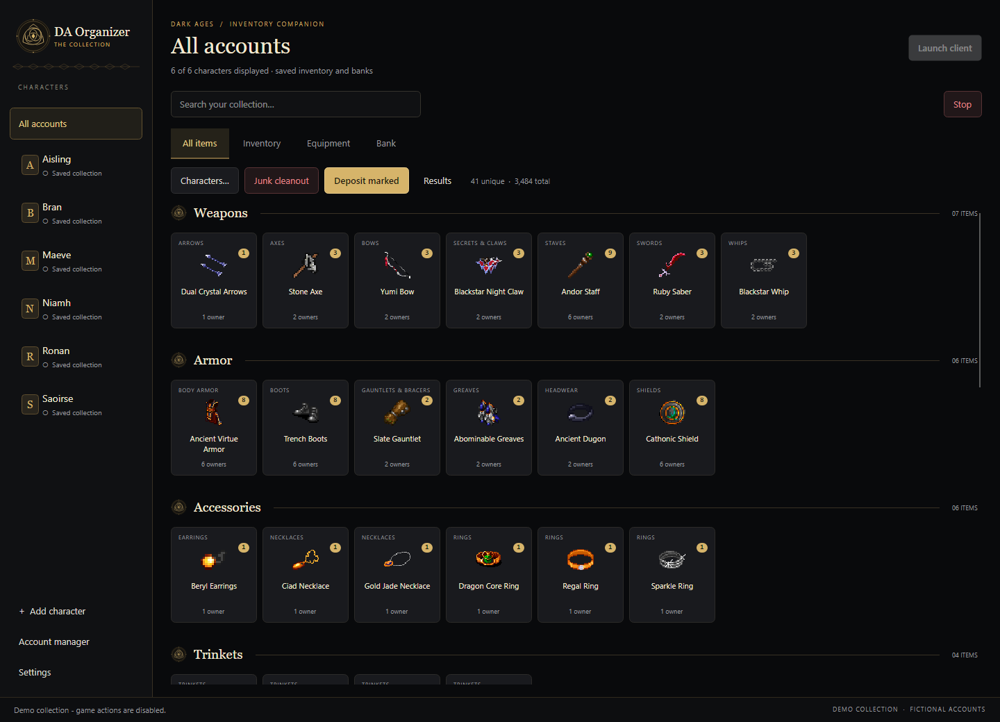
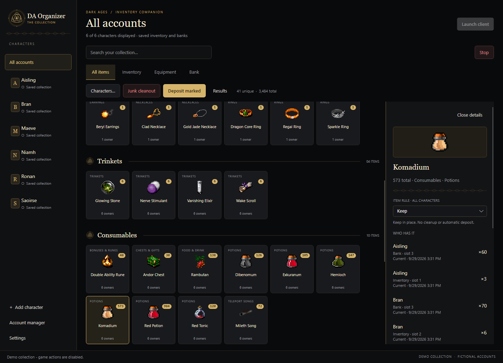
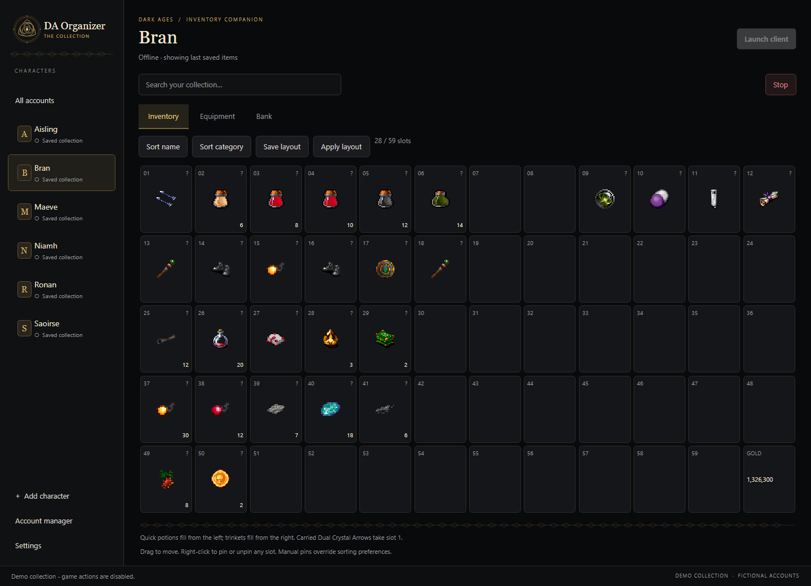
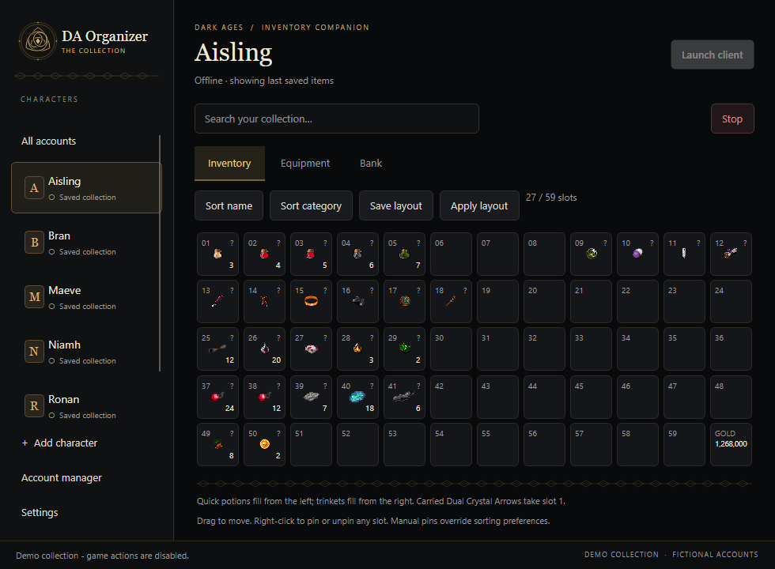
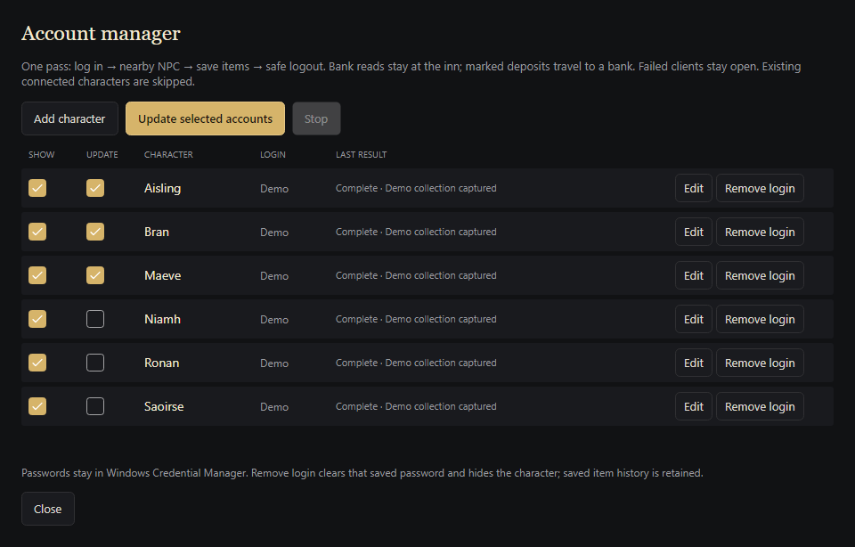
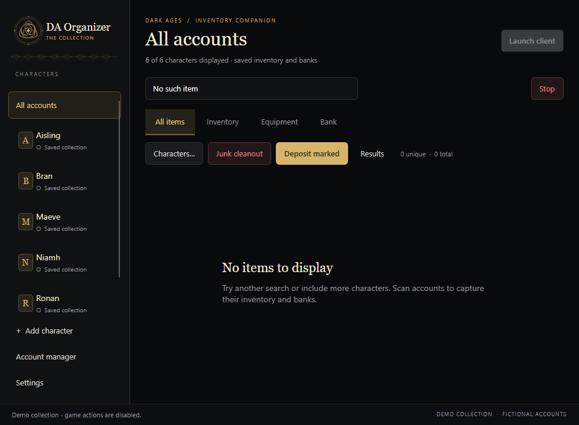

# Screenshot gallery

These are unedited renders of the actual Avalonia app using its fictional `--demo` collection. The headless gallery uses the same controls and styling as the desktop window. Names and quantities are fictional. Original game sprites are read from a local installation; their ownership remains with the game rights holders. No raw game assets are bundled.

## Collection



## Item ownership and rules



## Character inventory


## Crystal arrows first



## Compact window



## Account manager



## Empty search



## Regenerate

Build the solution, then run:

```powershell
dotnet tests/DAOrganizer.UiChecks/bin/Release/net10.0/DAOrganizer.UiChecks.dll artifacts/gallery --gallery --require-sprites
```

Set `DAORGANIZER_GAME_DATA` to your installed game-data folder if it is outside the default location. `--require-sprites` fails if real art is unavailable; CI omits it and tests text fallbacks without game files.

Review all seven images before copying them into this directory. The script checks demo isolation and blocks live operations before capturing the gallery. Do not substitute screenshots from a personal profile.
