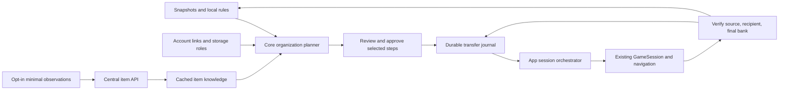

# Cross-character organization: architecture and phased plan

Status: design for review. Last checked: 2026-09-29. No transfer automation is authorized by this document alone.

## Goal and constraints

Find bank and inventory space opportunities across every known character; let user choose item holder and approve actions. Support direct and same-account transfers through a trusted middleman after each leg can be verified. Learn item facts locally, share minimal optional observations, and offer optional application updates. Existing single-character organization, account updates, and safe client handling must keep working.

Core plans from local data; App coordinates sessions and UI; Game owns protocol observations and actions. Do not create second inventory store, character manager, bank driver, navigation stack, or login path. Never close, stop, restart, or relaunch `Excalibur.exe` without explicit user permission in current conversation.

## Current architecture and reusable code

| Existing code | Reuse | Required extension |
| --- | --- | --- |
| `src/DAOrganizer.Core/InventoryStore.cs` | SQLite characters, item rows, complete/incomplete/stale inventory and bank snapshots | Versioned migrations, account relationships, metadata, rules, plans, execution journal; query freshness with rows |
| `src/DAOrganizer.Core/Contracts.cs` | `Item`, `StoredItem`, `CharacterSummary` | Persist stackability; preserve instance/slot identity and observation provenance |
| `src/DAOrganizer.Core/AccountCatalog.cs` | Character visibility, category resolution, explicit local category override | Game-account membership and storage roles; resolve metadata hierarchy |
| `src/DAOrganizer.Core/ItemMaintenance.cs` | `ItemGroups.Key`, Keep/Junk/AutoDeposit, preview and pin protection | Feed planner; keep current maintenance behavior and separate destination preferences |
| `src/DAOrganizer.Core/SlotPlanner.cs` | Same-character slot moves and stale preview rejection | Organization plan may include its moves without changing swap engine |
| `src/DAOrganizer.App/Organizer.Accounts.cs` | Saved login, one-pass scanning, bank travel, safe logout | Multi-session schedule constrained by game-account relationships |
| `src/DAOrganizer.App/Organizer.Maintenance.cs` | Existing bank and maintenance orchestration | Execute approved local steps; do not put cross-character routing in `MaintenanceRunner` |
| `src/DAOrganizer.Game/GameSession.cs` and `.Maintenance.cs` | Serialized observations, action gate, 59 inventory slots, bank scan, guarded deposit/withdraw | Track exchange lifecycle, human target, recipient changes, reusable checked bank actions |
| `src/DAOrganizer.Game/GameSession.Movement.cs`, `Navigation.cs`, `.Login.cs`, `.Logout.cs` | Movement, owned client launch/login/logout | Rendezvous and account-aware scheduling |
| `vendor/Arbiter/Arbiter.Net` | Client/server exchange packet types exist | Validate actual packet sequence and errors before enabling real trades |
| `src/DAOrganizer.App/MainWindow.Accounts.cs`, `.Items.cs` | Account Manager, collection owners, rule editor, preview/results patterns | Account roles, destination selection, opportunity and plan review, recovery UI |
| `.github/workflows/build.yml`, `tools/Package.ps1` | Windows test/build and portable self-contained app | Tag release, manifest, checksums, staged update |

`InventoryStore` currently writes `PRAGMA user_version=1` on every open. Migration work must replace that unconditional write before adding tables. `ServerAddInventoryMessage.IsStackable` is decoded by Arbiter but not copied into the saved `Item`. Bank list rows do not by themselves prove whether entries can merge or how much fits. `AccountCatalog` category override currently keys by name; `ItemRules` keys by name/sprite/color. Neither identifies a unique equipment instance. Saved passwords belong to character names in Windows Credential Manager, apart from SQLite. Current account-update queue processes characters sequentially, not account groups. No app exchange state machine exists.

## Chosen design and alternatives

Use a **local Core planner plus App orchestrator**, backed by existing store and GameSession. Planner remains pure and produces an immutable, inspectable proposal. Orchestrator executes approved steps and journals observations. GameSession alone sends and observes game actions.

Other approaches considered: expanding `MaintenanceRunner` would entangle single-character cleanup with two-session trade and recovery; central planning would require sending inventory and depend on the service. Neither fits current local-first architecture.

## Local data model and migration

Keep existing tables, JSON item records, settings, and credential vault. Add schema version checks in a transaction. Never set version lower on startup. A new binary encountering a newer unsupported schema should open read-only or stop before any write. Back up live profile with its SQLite WAL state before migrations; test migration from a real v1-shaped fixture and rollback on injected failure.

Add monotonic revision to each snapshot and to organization-affecting settings. Expose `ReadOrganizationState()` from `InventoryStore`: one SQLite read transaction returns characters, locations, items, snapshot states, pins, rules, account links, storage roles, overrides, and cached knowledge revision. Compute a deterministic input fingerprint from that result and save it with the proposal. Executor compares the relevant fingerprint before each step. This prevents a plan built from separate `Search()`/`Freshness()` calls from mixing old rows with new state.

Suggested tables, with foreign keys and case-insensitive uniqueness where appropriate:

- `game_accounts(id, label, same_account_coexistence)`; `character_accounts(character, account_id)`; `account_coexistence_overrides(account_id_a, account_id_b, policy, evidence)`. Account membership is manually assigned at first; unknown membership does not imply separate accounts. Same-account and cross-account `policy` each support `No`, `Yes`, `Unknown`. A direct or middleman leg requires `Yes` from user configuration or verified observation; unknown pairs remain review/manual-only. Normalize account-pair order and enforce unique rows.
- `storage_roles(id, character, label, priority, enabled)`; `storage_role_rules(id, role_id, match_kind, match_value, disposition, minimum_to_keep)`. Match item identity, category, or all. Explicit item destination outranks category, which outranks all-items. Resolve equal-priority conflicts in review instead of guessing. A character may have several roles.
- `item_metadata(item_key, canonical_category, observed_stackable, stack_limit, version, provenance)`; `item_overrides(item_key, category, destination_character, never_move, ...)`; `trade_observations(id, item_key, outcome, evidence_kind, observed_at, client_version, game_client_hash)`.
- `organization_plans(id, created_at, input_revision, state, summary_json)`; `plan_steps(id, plan_id, kind, source_character, destination_character, item_key, source_location, source_slot, approved_quantity, expected_before_json, state)`; `transfer_runs(id, plan_id, current_leg, custody_character, state, last_verified_json, error, updated_at)`; `transfer_evidence(id, run_id, session_character, direction, opcode, payload, observed_at)`. Evidence keeps only relevant trade/inventory packets locally under a bounded retention policy. It may contain character identity, so never include raw rows in telemetry or routine exported diagnostics.
- `intelligence_cache(revision, fetched_at, expires_at, etag, payload)`; `telemetry_outbox(id, event_type, item_key, payload, created_at, state)`. Outbox exists only for enabled sharing and obeys retention limits.

Use source slot and full observed item record for action preconditions. Preserve name/sprite/color grouping for discovery, then gate actual merge and transfer on stackability, capacity, unique-instance details, trade evidence, and current state. Current name-only bank withdrawal cannot safely select same-name variants; block those automated steps until a safer selector is established. Do not put community claims into canonical metadata automatically.

Category hierarchy: explicit user override > trusted/canonical metadata > qualified community recommendation > existing local heuristic > Other. Existing Keep/Junk/AutoDeposit remains an action rule. Preferred destination is independent; AutoDeposit must continue meaning current character's bank until user explicitly changes behavior. Add item, category, role and per-character exclusions.

## Plan generation and slot arithmetic

Input is a consistent read of all known characters, including characters hidden from collection view, with snapshot state and timestamps. Online session state may supersede saved inventory only after baseline is complete. Stale, incomplete, or never-scanned state yields `Needs scan`, not verified savings. A plan stores relevant snapshot revisions, rules, pins, account links, item intelligence version, and user decisions; executor checks them again before first action and each leg.

For each item group, report owner/location counts, candidate holder, bank entries now, bank entries predicted, transfers, prerequisites, uncertainty, and blockers. Explicit holder choice wins. Ranking: prevent loss and preserve user keep quantities; satisfy trusted trade/capacity evidence; minimize game exposure and session switching; then maximize verified net free slots. Show potential savings separately from confirmed savings. Nonstackable items moved to one bank may consume the same total slots. For stackable items, predicted destination entries require existing quantity, known cap, and enough bank capacity. Equipped and pinned items stay put unless user explicitly handles them. A plan may include same-character swap, bank, withdraw, direct transfer, middleman transfer, or manual-only steps.

Important game-specific correction: user reports Water Dungeon Chest is **not character-bound** and stacks **above five** in the current game. Vorlof's [treasure bag table](https://vorlof.com/daitems/treasurebags.htm) says `Stack 5` and `Bound`, so that external entry conflicts with direct user observation and must not seed canonical metadata or block this item. Planner should offer the consolidation opportunity. It may report four slots as **potential** savings when five bank entries could fit one destination stack; confirmed savings still require observed quantities, destination capacity, exact stack cap, and a verified transfer route. Do not infer the exact cap from either source.

## Direct transfer protocol and orchestration

Before implementing outbound exchange, capture one small **manual** trade on both clients: open, single-item selection, stack quantity prompt/reply, offers on both windows, both accepts, final close, and inventory changes. Store a local, operation-ID-linked trace of relevant packets with direction, opcode, full payload, character/session, and timing; never upload it as community telemetry. Compare every captured field to the vendored decoder **and** encoder: field order, byte order, String8 length/encoding, source inventory slot versus trade-window index, quantity bounds, partner runtime IDs, and close subtypes. User-supplied `/dasb` notes are observed behavior, not a DAOrganizer wire specification. Their referenced source paths (`src/features/dealer-item-transfer.ts`, `src/features/succi-hair-role.ts`, `DARKAGES_PROTOCOL_REFERENCE.md`, and shorter `DARKAGES-PROTOCOL.md`) were not available in this worktree; the shorter note reportedly omits a partner ID in some outbound layouts. Captured bytes decide.

Candidate flow to test against that capture:

1. Approve exact item, quantity, source, destination, and selected holder. Require distinct known sessions and saved credentials or live organizer-owned sessions. Recheck fresh complete inventories, pins, rules, account coexistence, recipient room, client health, and route. Require same map, adjacent authoritative positions, and fresh runtime IDs resolved to expected names. Reserve exact source slot/quantity. Allow one pending transfer per source.
2. If item is banked, travel with existing Navigation and withdraw through guarded bank action. Verify exact source inventory gain; rescan source bank when needed.
3. Sender opens exchange. `/dasb` reportedly sends client `0x4A` action `0` with recipient runtime ID. Require server `0x42` event `0` on **both** clients naming the expected partner and ID before offering anything.
4. Sender selects source slot. `/dasb` reportedly sends `0x4A` action `1` with partner ID and inventory slot. For a stack, wait for `0x42` event `1` quantity prompt correlated to that slot, then send `0x4A` action `2` with partner ID, slot, and one-byte quantity in `1..255`. Captured single-item flow determines whether it uses a quantity step. Break larger quantities into separately reviewed safe legs only after the limit is confirmed.
5. Require matching `0x42` event `2` offers on **both** sessions. Verify party, trade-window index, item identity, and exact offered quantity using proven packet fields or another validated observation. Reject extra items and event `3` gold. If quantity cannot be verified before acceptance, stop; final inventory deltas alone cannot protect against an unexpected offered amount. Persist acceptance intent after offer validation, then send `0x4A` action `5` from each side with that side's confirmed partner ID. Wait for server progress, not fixed sleeps.
6. Mark delivered only after both sessions show a captured, validated successful final exchange signal, source inventory drops by exact quantity, recipient inventory rises by exact quantity, and unrelated items/gold remain stable. Persist both before/after snapshots and the local trade trace with operation ID. Recipient then travels to bank, deposits, and completes a fresh bank scan. Complete plan step only after final bank quantity/location is verified.

GameSession needs exchange tracking and a two-session coordinator, including human entity tracking. Its `_actionGate` remains per session; orchestrator acquires parties in stable order to avoid deadlock. Manual item action, movement, damage, disconnect, timeout, target change, or mismatch halts further sends. Validate Arbiter exchange serialization against a controlled packet replay before any live automation. Do not probe transferability by dropping items.

Two local dual-session manual captures now validate single-item action 1 as action + partner ID + source slot (**no quantity byte**) and partial-stack action 2 as action + partner ID + slot + one-byte quantity. Vendored `ClientExchangeMessage.Serialize` was fixed for action 1; capture-derived tests cover both paths. Stack event 1 prompted for the source slot with an extra zero byte of unknown meaning. Event 2 carried party, trade-window index, sprite/color and display text with either a durability suffix or `(2)` quantity suffix, but no typed quantity field. The sender's stack dropped by exactly 2 before acceptance, while the recipient gained 2 after both accepts; unrelated inventory and gold stayed stable. Both captures showed event 5 `Accepted` on both sessions **before recipient acceptance**, so an individual event 5 is not final completion proof. Server `0x0F` carries slot, sprite, color, String8 name, four-byte quantity, stackable flag, max durability and durability; one recipient stack-add variant had an extra zero byte. Vendored server decoders/encoders now preserve unknown trailing bytes without interpreting them. Source `0x10` had four bytes; only the first (source slot) is understood. No `0x37` appeared. See [single-item](../../protocol-captures/2026-09-29-manual-single-item.md) and [partial-stack](../../protocol-captures/2026-09-29-manual-partial-stack.md) observations. The capture filter may omit a separate close opcode; final-close semantics, a two-session coordinator, and human-entity tracking remain Phase 3 gates before automated acceptance.

## Same-account and middleman routing

Planner builds a route graph from declared account membership and pairwise coexistence policy. Direct edge exists only when parties can coexist and trade. A trusted middleman from another account creates `A -> middleman -> B` only when both required account pairs can coexist. Middleman must have verified capacity, usable login, reachable rendezvous, no conflicting transfer, and explicit user trust flag. Route plan records both legs before execution. Custody persists between legs; source logout is attempted only after first leg receipt is verified. Destination login happens after source is safely offline. The second leg follows the same direct-transfer engine. If middleman cannot complete second leg, items remain visibly assigned to middleman in recovery view.

## Failure and recovery

Game operations cannot join one SQLite transaction. Use durable saga states: `Proposed`, `Approved`, `Preparing`, `InSourceInventory`, `ExchangeOpen`, `Offered`, `Accepting`, `RecipientVerified`, `Banking`, `Complete`, `NeedsReconciliation`, `Failed`. Record intent before each external send; record the specific acceptance intent only after both offers validate. Persist observations afterward and last **verified** holder and quantity. A sent packet or timeout never advances custody. On cancel, timeout, disconnect, partner ID/name mismatch, malformed packet, or uncertain inventory, stop and mark `NeedsReconciliation`. Send cancel only to still-matching live sessions. Never automatically replay an ambiguous exchange. After reconnect, scan both inventories and relevant banks, compare with journal, and resume only a verified remainder. Keep failed owned clients open for manual handling under existing safety policy. Provide `Resume verified remainder`, `Mark resolved after scans`, and `Export local diagnostic summary` without credentials or raw packets. Stop operation if conservation fails or unexpected items/gold appear.

## Tradeability and community intelligence

Local state `Unknown`, `EvidenceTradeable`, `EvidenceNonTradeable`, with positive/negative counts, event type, time, versions and confidence. Confirmed two-party receipt is positive evidence. A specific item-placement/trade denial is negative evidence. Generic cancellation, timeout, full inventory, distance, target loss, or login conflict is inconclusive. Conflicting evidence lowers confidence; age and version changes decay it. One failure never permanently changes canonical data.

Telemetry defaults off. Settings explains categories of events and deletion. Send item key plus changed category/rule or a verified trade outcome and client/protocol version. Do not send names of characters/accounts, credentials, slot numbers, inventory lists, or route history. Locally batch a bounded outbox; organization works offline. User override always wins over downloaded knowledge.

Server API proposal: `POST /v1/observations` with bounded idempotent events; `GET /v1/items/changes?since=<revision>` with ETag, expiry, confidence and provenance; `GET /v1/client-policy` for supported API/client versions and defaults. TLS. Installation-scoped random credential, rotating/revocable tokens, server rate limits, idempotency keys, per-item vote caps, version filtering, delayed promotion, diverse reporter thresholds, and moderator review for canonical changes. Installation identity does **not** prove unique human; limit influence instead of claiming Sybil resistance. Keep aggregate observations separate from canonical metadata. Central outage only postpones sync.

## Update and deployment plan

Current app is a self-contained, unsigned Windows ZIP; profile is under `%LOCALAPPDATA%\DAOrganizer`, credentials under Windows Credential Manager. Current CI builds/packages on main/PR but does not publish tags. Add tag workflow: assert tag matches project version/changelog, run build and tests, publish ZIP and checksums, release notes, Stable/Beta channel manifest, then GitHub release. Add optional check UI showing version, channel, notes, size and source. Client downloads into a new version directory, checks SHA-256 against authenticated release metadata, and stages switch after user chooses Update, operations end, and organizer-owned sessions safely log out. Never touch Excalibur. Releases default to optional; any future `required` policy must name a concrete compatibility/security reason, minimum supported version, and safe handling for offline users. Retain previous binaries. Migrations need backup and compatibility rule before updater can offer rollback; a binary rollback cannot blindly reuse a newer incompatible database. Treat code signing as separate release hardening; checksum alone does not defend a compromised publisher.

## Phases and acceptance gates

1. **Foundation.** Repair versioning, migrate schema, persist stackability, add game accounts/storage roles/item overrides. Existing v1 data and all current actions work. Test upgrade, failure rollback, unknown accounts, role precedence, preserved credential separation.
2. **Read-only planner.** All-character analysis, freshness and capacity-aware savings, route classification, holder picker, immutable plan preview. No live transfer packets. Test five-owner cases for stackable, nonstackable, capped, unknown trade state, stale, pinned, full bank, conflicting roles, duplicate variants. Include Water Dungeon Chest as a case where external metadata conflicts with a user's current-game observation.
3. **Direct transfer.** First obtain sanitized dual-session manual-trade fixtures and verify inbound/outbound codec, offered quantity, final close, and inventory opcodes. Then add exchange observer, two-party coordinator, journal, scans and recovery. Test packet ordering, both-party quantity conservation, rejection, cancellation, partner mismatch, extra gold/items, concurrent manual input, and disconnect at each stage. Controlled live validation with a low-value explicitly tradeable item before broader enablement.
4. **Middleman routing.** Account-aware login scheduler, two verified legs, custody resume. Test same-account prohibition, middleman capacity, interruption between legs, wrong-character login, and logout refusal.
5. **Community intelligence.** Local evidence and settings first; then optional outbox/API, consensus and cached recommendations. Test anonymous payload schema, duplicates, spam caps, old versions, offline behavior, override precedence.
6. **Updates.** Tag release and check UI, staged installer, migration backup/rollback rules, channel compatibility. Test corrupted artifact, interrupted download, active sessions, migration failure, old binary recovery.

No phase may claim live trade safety from synthetic tests alone. Each phase leaves current application usable. First implementation handoff is in `docs/handoffs/cross-character-organization.md`.

## Request coverage for review

| User question | Design location |
| --- | --- |
| 1. Reusable infrastructure; 2. Existing code to extend | Current architecture table |
| 3. New services/models; 4. Schema | Chosen design; local data model |
| 5. Account Manager | Game-account and storage-role models; App UI row; middleman routing |
| 6. Optimization engine | Plan generation and slot arithmetic |
| 7. Direct transfers | Direct transfer protocol and orchestration |
| 8. Middleman transfers | Same-account and middleman routing |
| 9. Failures and recovery | Failure and recovery |
| 10. Tradeability learning | Tradeability and community intelligence |
| 11. Community intelligence; 12. Central API; 13. Authentication and abuse | Tradeability and community intelligence |
| 14. Updates with current deployment | Update and deployment plan |
| 15. Build now versus later | Phases and acceptance gates |

## Open evidence and review decisions

- User review: confirm account grouping is manual initially; whether separate login accounts can ever coexist must be recorded explicitly.
- Verify current-game bank stack caps and actual recipient capacity. Current bank list lacks enough data to infer every cap.
- Capture sanitized exchange success and explicit item denial from supported client, with consent and no credentials/chat, before mapping outcomes to tradeability.
- Determine whether game offers a safe way to identify same-name bank variants for withdrawal; until then block them.
- Establish actual Water Dungeon Chest stack cap and exchange outcome through local observation. User reports it is transferable and stacks above five; Vorlof's contradictory entry must not promote global item metadata.
